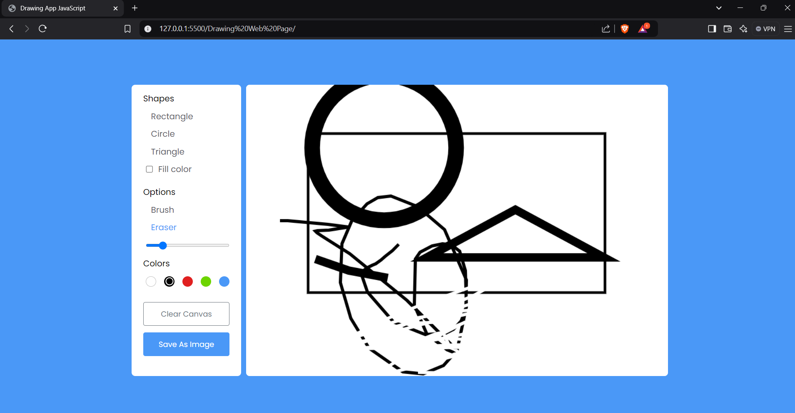
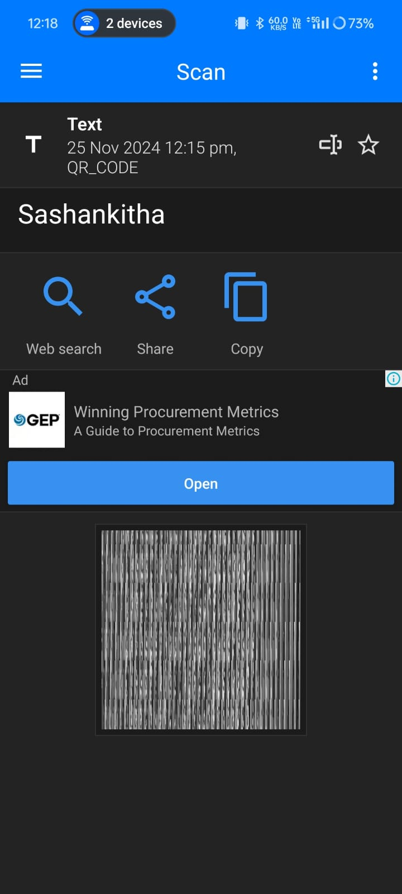

<h1>
  QR code Generator
</h1>
<h3>
  summary 
</h3>

  The QR code generator is a practical web-based application developed using HTML, CSS, and JavaScript. It enables users to create QR codes for any text or URL with ease and efficiency. The interface consists of an input field where users can enter the desired content and a "Generate" button to produce the QR code. Once generated, the QR code is displayed dynamically, offering options to download it as an image file for future use.

The design is simple and responsive, ensuring compatibility across devices and screen sizes. CSS enhances the visual appeal with clean layouts and intuitive styling, while JavaScript powers the application’s core functionality, including integrating APIs (such as Google Charts or custom QR libraries) to generate the QR code dynamically.

This project is a practical demonstration of front-end web development skills, combining user interactivity with a functional purpose. It also highlights proficiency in DOM manipulation, event handling, and third-party API usage. The QR code generator is ideal for small businesses, personal use, or educational purposes, allowing users to create shareable codes for promotions, links, or information effortlessly.

<h3>
  The output of the following code is:-
</h3>

<h4>
  The proof:-
</h4>

